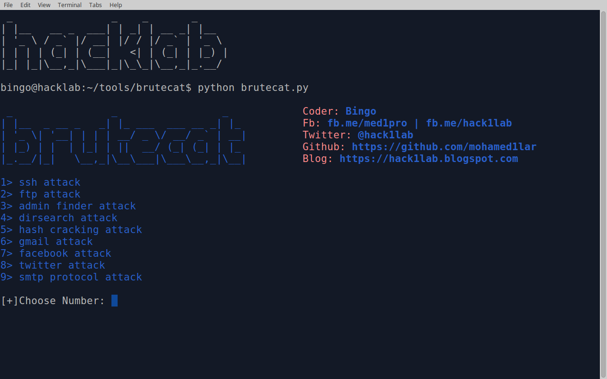

# BruteCat
brutecat is a tool for bruteforce attack, Multi-targets: 
Facebook, twitter, ssh, ftp, directory search, admin login finder, hash cracking and so on :)
 

# Requirements:
tor service 
modules: pexpect, mechanize, smtplib, urllib2, socks, socket

# How It Work !?
if you want to install BruteCat just use create_lancher.py to install it. 
run the tool and choose number from the list with the following command: 

> python brutecat.py
